# Gapminder data: how has the world changed for 200 years?

## Table of Contents
<ul>
<li><a href="#intro">Introduction</a></li>
<li><a href="#wrangling">Data Wrangling</a></li>
<li><a href="#eda">Exploratory Data Analysis</a></li>
<li><a href="#conclusions">Conclusions</a></li>
</ul>

<a id='intro'></a>
## Introduction

"Gapminder fights devastating misconceptions about global development. Gapminder produces free teaching resources making the world understandable based on reliable statistics." - source [Gapminder](https://www.gapminder.org/about-gapminder/)

Gapminder was founded by Hans Roosling along with his son and his daughter-in-law. One of their works was published into a book named "Factfulness" which aims to change the way we look at the world mere by data. In this small project, we will try to look at some of the datasets of Gapminder to discover some interesting facts about the global change from 1800-2000. Here are questions we have asked ourselves:

- Which region of the world has been changing relatively quickly compare to others in terms of GDP, life expectancy, and other indices?
- How income, population, child mortality and children born per woman decide the life expectancy of a certain country?


```python
# Importing neccessary libraries
import pandas as pd
import numpy as np
import matplotlib.pyplot as plt
import seaborn as sns
% matplotlib inline
```

<a id='wrangling'></a>
## Data Wrangling

### General properties


```python
# Import life expectancy dataframe
life_exp = pd.read_csv('life_expectancy_years.csv')
life_exp.head()
```


<div>
<table border="1" class="dataframe">
  <thead>
    <tr style="text-align: right;">
      <th></th>
      <th>geo</th>
      <th>1800</th>
      <th>1801</th>
      <th>1802</th>
      <th>1803</th>
      <th>1804</th>
      <th>1805</th>
      <th>1806</th>
      <th>1807</th>
      <th>1808</th>
      <th>...</th>
      <th>2009</th>
      <th>2010</th>
      <th>2011</th>
      <th>2012</th>
      <th>2013</th>
      <th>2014</th>
      <th>2015</th>
      <th>2016</th>
      <th>2017</th>
      <th>2018</th>
    </tr>
  </thead>
  <tbody>
    <tr>
      <th>0</th>
      <td>Afghanistan</td>
      <td>28.2</td>
      <td>28.2</td>
      <td>28.2</td>
      <td>28.2</td>
      <td>28.2</td>
      <td>28.2</td>
      <td>28.1</td>
      <td>28.1</td>
      <td>28.1</td>
      <td>...</td>
      <td>55.7</td>
      <td>56.2</td>
      <td>56.7</td>
      <td>57.2</td>
      <td>57.7</td>
      <td>57.8</td>
      <td>57.9</td>
      <td>58.0</td>
      <td>58.4</td>
      <td>58.7</td>
    </tr>
    <tr>
      <th>1</th>
      <td>Albania</td>
      <td>35.4</td>
      <td>35.4</td>
      <td>35.4</td>
      <td>35.4</td>
      <td>35.4</td>
      <td>35.4</td>
      <td>35.4</td>
      <td>35.4</td>
      <td>35.4</td>
      <td>...</td>
      <td>75.9</td>
      <td>76.3</td>
      <td>76.7</td>
      <td>77.0</td>
      <td>77.2</td>
      <td>77.4</td>
      <td>77.6</td>
      <td>77.7</td>
      <td>77.9</td>
      <td>78.0</td>
    </tr>
    <tr>
      <th>2</th>
      <td>Algeria</td>
      <td>28.8</td>
      <td>28.8</td>
      <td>28.8</td>
      <td>28.8</td>
      <td>28.8</td>
      <td>28.8</td>
      <td>28.8</td>
      <td>28.8</td>
      <td>28.8</td>
      <td>...</td>
      <td>76.3</td>
      <td>76.5</td>
      <td>76.7</td>
      <td>76.8</td>
      <td>77.0</td>
      <td>77.1</td>
      <td>77.3</td>
      <td>77.4</td>
      <td>77.6</td>
      <td>77.9</td>
    </tr>
    <tr>
      <th>3</th>
      <td>Andorra</td>
      <td>NaN</td>
      <td>NaN</td>
      <td>NaN</td>
      <td>NaN</td>
      <td>NaN</td>
      <td>NaN</td>
      <td>NaN</td>
      <td>NaN</td>
      <td>NaN</td>
      <td>...</td>
      <td>82.7</td>
      <td>82.7</td>
      <td>82.6</td>
      <td>82.6</td>
      <td>82.6</td>
      <td>82.6</td>
      <td>82.5</td>
      <td>82.5</td>
      <td>NaN</td>
      <td>NaN</td>
    </tr>
    <tr>
      <th>4</th>
      <td>Angola</td>
      <td>27.0</td>
      <td>27.0</td>
      <td>27.0</td>
      <td>27.0</td>
      <td>27.0</td>
      <td>27.0</td>
      <td>27.0</td>
      <td>27.0</td>
      <td>27.0</td>
      <td>...</td>
      <td>59.3</td>
      <td>60.1</td>
      <td>60.9</td>
      <td>61.7</td>
      <td>62.5</td>
      <td>63.3</td>
      <td>64.0</td>
      <td>64.7</td>
      <td>64.9</td>
      <td>65.2</td>
    </tr>
  </tbody>
</table>
<p>5 rows × 220 columns</p>
</div>


```python
# Importing income per person dataframe
income = pd.read_csv('income_per_person_gdppercapita_ppp_inflation_adjusted.csv')
income.head()
```


<div>
<table border="1" class="dataframe">
  <thead>
    <tr style="text-align: right;">
      <th></th>
      <th>geo</th>
      <th>1800</th>
      <th>1801</th>
      <th>1802</th>
      <th>1803</th>
      <th>1804</th>
      <th>1805</th>
      <th>1806</th>
      <th>1807</th>
      <th>1808</th>
      <th>...</th>
      <th>2009</th>
      <th>2010</th>
      <th>2011</th>
      <th>2012</th>
      <th>2013</th>
      <th>2014</th>
      <th>2015</th>
      <th>2016</th>
      <th>2017</th>
      <th>2018</th>
    </tr>
  </thead>
  <tbody>
    <tr>
      <th>0</th>
      <td>Afghanistan</td>
      <td>603</td>
      <td>603</td>
      <td>603</td>
      <td>603</td>
      <td>603</td>
      <td>603</td>
      <td>603</td>
      <td>603</td>
      <td>603</td>
      <td>...</td>
      <td>1530</td>
      <td>1610</td>
      <td>1660</td>
      <td>1840</td>
      <td>1810</td>
      <td>1780</td>
      <td>1750</td>
      <td>1740</td>
      <td>1800</td>
      <td>1870</td>
    </tr>
    <tr>
      <th>1</th>
      <td>Albania</td>
      <td>667</td>
      <td>667</td>
      <td>667</td>
      <td>667</td>
      <td>667</td>
      <td>668</td>
      <td>668</td>
      <td>668</td>
      <td>668</td>
      <td>...</td>
      <td>9530</td>
      <td>9930</td>
      <td>10200</td>
      <td>10400</td>
      <td>10500</td>
      <td>10700</td>
      <td>11000</td>
      <td>11400</td>
      <td>11900</td>
      <td>12400</td>
    </tr>
    <tr>
      <th>2</th>
      <td>Algeria</td>
      <td>715</td>
      <td>716</td>
      <td>717</td>
      <td>718</td>
      <td>719</td>
      <td>720</td>
      <td>721</td>
      <td>722</td>
      <td>723</td>
      <td>...</td>
      <td>12600</td>
      <td>12900</td>
      <td>13000</td>
      <td>13200</td>
      <td>13300</td>
      <td>13500</td>
      <td>13700</td>
      <td>14000</td>
      <td>13800</td>
      <td>13700</td>
    </tr>
    <tr>
      <th>3</th>
      <td>Andorra</td>
      <td>1200</td>
      <td>1200</td>
      <td>1200</td>
      <td>1200</td>
      <td>1210</td>
      <td>1210</td>
      <td>1210</td>
      <td>1210</td>
      <td>1220</td>
      <td>...</td>
      <td>41700</td>
      <td>39000</td>
      <td>42000</td>
      <td>41900</td>
      <td>43700</td>
      <td>44900</td>
      <td>46600</td>
      <td>48200</td>
      <td>49800</td>
      <td>51500</td>
    </tr>
    <tr>
      <th>4</th>
      <td>Angola</td>
      <td>618</td>
      <td>620</td>
      <td>623</td>
      <td>626</td>
      <td>628</td>
      <td>631</td>
      <td>634</td>
      <td>637</td>
      <td>640</td>
      <td>...</td>
      <td>5910</td>
      <td>5900</td>
      <td>5910</td>
      <td>6000</td>
      <td>6190</td>
      <td>6260</td>
      <td>6230</td>
      <td>6030</td>
      <td>5940</td>
      <td>5850</td>
    </tr>
  </tbody>
</table>
<p>5 rows × 220 columns</p>
</div>


```python
# Importing children per woman dataframe
children_per_woman = pd.read_csv('children_per_woman_total_fertility.csv')
children_per_woman.head()
```


<div>
<table border="1" class="dataframe">
  <thead>
    <tr style="text-align: right;">
      <th></th>
      <th>geo</th>
      <th>1800</th>
      <th>1801</th>
      <th>1802</th>
      <th>1803</th>
      <th>1804</th>
      <th>1805</th>
      <th>1806</th>
      <th>1807</th>
      <th>1808</th>
      <th>...</th>
      <th>2009</th>
      <th>2010</th>
      <th>2011</th>
      <th>2012</th>
      <th>2013</th>
      <th>2014</th>
      <th>2015</th>
      <th>2016</th>
      <th>2017</th>
      <th>2018</th>
    </tr>
  </thead>
  <tbody>
    <tr>
      <th>0</th>
      <td>Afghanistan</td>
      <td>7.00</td>
      <td>7.00</td>
      <td>7.00</td>
      <td>7.00</td>
      <td>7.00</td>
      <td>7.00</td>
      <td>7.00</td>
      <td>7.00</td>
      <td>7.00</td>
      <td>...</td>
      <td>6.04</td>
      <td>5.82</td>
      <td>5.60</td>
      <td>5.38</td>
      <td>5.17</td>
      <td>4.98</td>
      <td>4.80</td>
      <td>4.64</td>
      <td>4.48</td>
      <td>4.33</td>
    </tr>
    <tr>
      <th>1</th>
      <td>Albania</td>
      <td>4.60</td>
      <td>4.60</td>
      <td>4.60</td>
      <td>4.60</td>
      <td>4.60</td>
      <td>4.60</td>
      <td>4.60</td>
      <td>4.60</td>
      <td>4.60</td>
      <td>...</td>
      <td>1.65</td>
      <td>1.65</td>
      <td>1.67</td>
      <td>1.69</td>
      <td>1.70</td>
      <td>1.71</td>
      <td>1.71</td>
      <td>1.71</td>
      <td>1.71</td>
      <td>1.71</td>
    </tr>
    <tr>
      <th>2</th>
      <td>Algeria</td>
      <td>6.99</td>
      <td>6.99</td>
      <td>6.99</td>
      <td>6.99</td>
      <td>6.99</td>
      <td>6.99</td>
      <td>6.99</td>
      <td>6.99</td>
      <td>6.99</td>
      <td>...</td>
      <td>2.83</td>
      <td>2.89</td>
      <td>2.93</td>
      <td>2.94</td>
      <td>2.92</td>
      <td>2.89</td>
      <td>2.84</td>
      <td>2.78</td>
      <td>2.71</td>
      <td>2.64</td>
    </tr>
    <tr>
      <th>3</th>
      <td>Angola</td>
      <td>6.93</td>
      <td>6.93</td>
      <td>6.93</td>
      <td>6.93</td>
      <td>6.93</td>
      <td>6.93</td>
      <td>6.93</td>
      <td>6.94</td>
      <td>6.94</td>
      <td>...</td>
      <td>6.24</td>
      <td>6.16</td>
      <td>6.08</td>
      <td>6.00</td>
      <td>5.92</td>
      <td>5.84</td>
      <td>5.77</td>
      <td>5.69</td>
      <td>5.62</td>
      <td>5.55</td>
    </tr>
    <tr>
      <th>4</th>
      <td>Antigua and Barbuda</td>
      <td>5.00</td>
      <td>5.00</td>
      <td>4.99</td>
      <td>4.99</td>
      <td>4.99</td>
      <td>4.98</td>
      <td>4.98</td>
      <td>4.97</td>
      <td>4.97</td>
      <td>...</td>
      <td>2.15</td>
      <td>2.13</td>
      <td>2.12</td>
      <td>2.10</td>
      <td>2.09</td>
      <td>2.08</td>
      <td>2.06</td>
      <td>2.05</td>
      <td>2.04</td>
      <td>2.03</td>
    </tr>
  </tbody>
</table>
<p>5 rows × 220 columns</p>
</div>


```python
# Importing population dataframe
population = pd.read_csv('population_total.csv')
population.head()
```


<div>
<table border="1" class="dataframe">
  <thead>
    <tr style="text-align: right;">
      <th></th>
      <th>geo</th>
      <th>1800</th>
      <th>1801</th>
      <th>1802</th>
      <th>1803</th>
      <th>1804</th>
      <th>1805</th>
      <th>1806</th>
      <th>1807</th>
      <th>1808</th>
      <th>...</th>
      <th>2009</th>
      <th>2010</th>
      <th>2011</th>
      <th>2012</th>
      <th>2013</th>
      <th>2014</th>
      <th>2015</th>
      <th>2016</th>
      <th>2017</th>
      <th>2018</th>
    </tr>
  </thead>
  <tbody>
    <tr>
      <th>0</th>
      <td>Afghanistan</td>
      <td>3280000</td>
      <td>3280000</td>
      <td>3280000</td>
      <td>3280000</td>
      <td>3280000</td>
      <td>3280000</td>
      <td>3280000</td>
      <td>3280000</td>
      <td>3280000</td>
      <td>...</td>
      <td>28000000</td>
      <td>28800000</td>
      <td>29700000</td>
      <td>30700000</td>
      <td>31700000</td>
      <td>32800000</td>
      <td>33700000</td>
      <td>34700000</td>
      <td>35500000</td>
      <td>36400000</td>
    </tr>
    <tr>
      <th>1</th>
      <td>Albania</td>
      <td>410000</td>
      <td>412000</td>
      <td>413000</td>
      <td>414000</td>
      <td>416000</td>
      <td>417000</td>
      <td>418000</td>
      <td>420000</td>
      <td>421000</td>
      <td>...</td>
      <td>2960000</td>
      <td>2940000</td>
      <td>2930000</td>
      <td>2920000</td>
      <td>2920000</td>
      <td>2920000</td>
      <td>2920000</td>
      <td>2930000</td>
      <td>2930000</td>
      <td>2930000</td>
    </tr>
    <tr>
      <th>2</th>
      <td>Algeria</td>
      <td>2500000</td>
      <td>2510000</td>
      <td>2520000</td>
      <td>2530000</td>
      <td>2540000</td>
      <td>2550000</td>
      <td>2560000</td>
      <td>2570000</td>
      <td>2580000</td>
      <td>...</td>
      <td>35500000</td>
      <td>36100000</td>
      <td>36800000</td>
      <td>37600000</td>
      <td>38300000</td>
      <td>39100000</td>
      <td>39900000</td>
      <td>40600000</td>
      <td>41300000</td>
      <td>42000000</td>
    </tr>
    <tr>
      <th>3</th>
      <td>Andorra</td>
      <td>2650</td>
      <td>2650</td>
      <td>2650</td>
      <td>2650</td>
      <td>2650</td>
      <td>2650</td>
      <td>2650</td>
      <td>2650</td>
      <td>2650</td>
      <td>...</td>
      <td>84500</td>
      <td>84400</td>
      <td>83800</td>
      <td>82400</td>
      <td>80800</td>
      <td>79200</td>
      <td>78000</td>
      <td>77300</td>
      <td>77000</td>
      <td>77000</td>
    </tr>
    <tr>
      <th>4</th>
      <td>Angola</td>
      <td>1570000</td>
      <td>1570000</td>
      <td>1570000</td>
      <td>1570000</td>
      <td>1570000</td>
      <td>1570000</td>
      <td>1570000</td>
      <td>1570000</td>
      <td>1570000</td>
      <td>...</td>
      <td>22500000</td>
      <td>23400000</td>
      <td>24200000</td>
      <td>25100000</td>
      <td>26000000</td>
      <td>26900000</td>
      <td>27900000</td>
      <td>28800000</td>
      <td>29800000</td>
      <td>30800000</td>
    </tr>
  </tbody>
</table>
<p>5 rows × 220 columns</p>
</div>


```python
# Importing child mortality dataframe
child_mortality = pd.read_csv('child_mortality_0_5_year_olds_dying_per_1000_born.csv')
child_mortality.head()
```


<div>
<table border="1" class="dataframe">
  <thead>
    <tr style="text-align: right;">
      <th></th>
      <th>geo</th>
      <th>1800</th>
      <th>1801</th>
      <th>1802</th>
      <th>1803</th>
      <th>1804</th>
      <th>1805</th>
      <th>1806</th>
      <th>1807</th>
      <th>1808</th>
      <th>...</th>
      <th>2009</th>
      <th>2010</th>
      <th>2011</th>
      <th>2012</th>
      <th>2013</th>
      <th>2014</th>
      <th>2015</th>
      <th>2016</th>
      <th>2017</th>
      <th>2018</th>
    </tr>
  </thead>
  <tbody>
    <tr>
      <th>0</th>
      <td>Afghanistan</td>
      <td>469.0</td>
      <td>469.0</td>
      <td>469.0</td>
      <td>469.0</td>
      <td>469.0</td>
      <td>469.0</td>
      <td>470.0</td>
      <td>470.0</td>
      <td>470.0</td>
      <td>...</td>
      <td>94.1</td>
      <td>90.2</td>
      <td>86.4</td>
      <td>82.8</td>
      <td>79.3</td>
      <td>76.1</td>
      <td>73.2</td>
      <td>70.4</td>
      <td>68.2</td>
      <td>65.9</td>
    </tr>
    <tr>
      <th>1</th>
      <td>Albania</td>
      <td>375.0</td>
      <td>375.0</td>
      <td>375.0</td>
      <td>375.0</td>
      <td>375.0</td>
      <td>375.0</td>
      <td>375.0</td>
      <td>375.0</td>
      <td>375.0</td>
      <td>...</td>
      <td>17.2</td>
      <td>16.6</td>
      <td>16.0</td>
      <td>15.4</td>
      <td>14.9</td>
      <td>14.4</td>
      <td>14.0</td>
      <td>13.5</td>
      <td>13.3</td>
      <td>12.9</td>
    </tr>
    <tr>
      <th>2</th>
      <td>Algeria</td>
      <td>460.0</td>
      <td>460.0</td>
      <td>460.0</td>
      <td>460.0</td>
      <td>460.0</td>
      <td>460.0</td>
      <td>460.0</td>
      <td>460.0</td>
      <td>460.0</td>
      <td>...</td>
      <td>28.3</td>
      <td>27.3</td>
      <td>26.6</td>
      <td>26.1</td>
      <td>25.8</td>
      <td>25.6</td>
      <td>25.5</td>
      <td>25.2</td>
      <td>23.9</td>
      <td>23.1</td>
    </tr>
    <tr>
      <th>3</th>
      <td>Andorra</td>
      <td>NaN</td>
      <td>NaN</td>
      <td>NaN</td>
      <td>NaN</td>
      <td>NaN</td>
      <td>NaN</td>
      <td>NaN</td>
      <td>NaN</td>
      <td>NaN</td>
      <td>...</td>
      <td>3.4</td>
      <td>3.3</td>
      <td>3.2</td>
      <td>3.1</td>
      <td>3.0</td>
      <td>2.9</td>
      <td>2.8</td>
      <td>2.7</td>
      <td>NaN</td>
      <td>NaN</td>
    </tr>
    <tr>
      <th>4</th>
      <td>Angola</td>
      <td>486.0</td>
      <td>486.0</td>
      <td>486.0</td>
      <td>486.0</td>
      <td>486.0</td>
      <td>486.0</td>
      <td>486.0</td>
      <td>486.0</td>
      <td>486.0</td>
      <td>...</td>
      <td>128.0</td>
      <td>119.0</td>
      <td>111.0</td>
      <td>104.0</td>
      <td>96.8</td>
      <td>91.2</td>
      <td>86.5</td>
      <td>82.5</td>
      <td>83.1</td>
      <td>81.6</td>
    </tr>
  </tbody>
</table>
<p>5 rows × 220 columns</p>
</div>


### Data Cleaning


```python
# Check if there are any missing data, if yes drop the rows containing missing data
def check_and_drop(df):
    if pd.isna(df).sum().sum():
        return df.dropna(axis=0)
    return df
life_exp = check_and_drop(life_exp)
income = check_and_drop(income)
population = check_and_drop(population)
children_per_woman = check_and_drop(children_per_woman)
child_mortality = check_and_drop(child_mortality)
```

Now to answer the first question as well as simplify other operations for later, we are going to concatenate all the small dataframes created to two ultimate dataframe gapminder_1800 and gapminder_2000


```python
# Merge all the dataframes into a big one
from functools import reduce
df_list = [life_exp, income, population, children_per_woman, child_mortality]

gapminder = reduce(lambda left, right: pd.merge(left, right, on='geo'), df_list)
gapminder.head()
```


<div>
<table border="1" class="dataframe">
  <thead>
    <tr style="text-align: right;">
      <th></th>
      <th>geo</th>
      <th>1800_x</th>
      <th>1801_x</th>
      <th>1802_x</th>
      <th>1803_x</th>
      <th>1804_x</th>
      <th>1805_x</th>
      <th>1806_x</th>
      <th>1807_x</th>
      <th>1808_x</th>
      <th>...</th>
      <th>2009</th>
      <th>2010</th>
      <th>2011</th>
      <th>2012</th>
      <th>2013</th>
      <th>2014</th>
      <th>2015</th>
      <th>2016</th>
      <th>2017</th>
      <th>2018</th>
    </tr>
  </thead>
  <tbody>
    <tr>
      <th>0</th>
      <td>Afghanistan</td>
      <td>28.2</td>
      <td>28.2</td>
      <td>28.2</td>
      <td>28.2</td>
      <td>28.2</td>
      <td>28.2</td>
      <td>28.1</td>
      <td>28.1</td>
      <td>28.1</td>
      <td>...</td>
      <td>94.1</td>
      <td>90.2</td>
      <td>86.4</td>
      <td>82.8</td>
      <td>79.3</td>
      <td>76.1</td>
      <td>73.2</td>
      <td>70.4</td>
      <td>68.20</td>
      <td>65.90</td>
    </tr>
    <tr>
      <th>1</th>
      <td>Albania</td>
      <td>35.4</td>
      <td>35.4</td>
      <td>35.4</td>
      <td>35.4</td>
      <td>35.4</td>
      <td>35.4</td>
      <td>35.4</td>
      <td>35.4</td>
      <td>35.4</td>
      <td>...</td>
      <td>17.2</td>
      <td>16.6</td>
      <td>16.0</td>
      <td>15.4</td>
      <td>14.9</td>
      <td>14.4</td>
      <td>14.0</td>
      <td>13.5</td>
      <td>13.30</td>
      <td>12.90</td>
    </tr>
    <tr>
      <th>2</th>
      <td>Algeria</td>
      <td>28.8</td>
      <td>28.8</td>
      <td>28.8</td>
      <td>28.8</td>
      <td>28.8</td>
      <td>28.8</td>
      <td>28.8</td>
      <td>28.8</td>
      <td>28.8</td>
      <td>...</td>
      <td>28.3</td>
      <td>27.3</td>
      <td>26.6</td>
      <td>26.1</td>
      <td>25.8</td>
      <td>25.6</td>
      <td>25.5</td>
      <td>25.2</td>
      <td>23.90</td>
      <td>23.10</td>
    </tr>
    <tr>
      <th>3</th>
      <td>Angola</td>
      <td>27.0</td>
      <td>27.0</td>
      <td>27.0</td>
      <td>27.0</td>
      <td>27.0</td>
      <td>27.0</td>
      <td>27.0</td>
      <td>27.0</td>
      <td>27.0</td>
      <td>...</td>
      <td>128.0</td>
      <td>119.0</td>
      <td>111.0</td>
      <td>104.0</td>
      <td>96.8</td>
      <td>91.2</td>
      <td>86.5</td>
      <td>82.5</td>
      <td>83.10</td>
      <td>81.60</td>
    </tr>
    <tr>
      <th>4</th>
      <td>Antigua and Barbuda</td>
      <td>33.5</td>
      <td>33.5</td>
      <td>33.5</td>
      <td>33.5</td>
      <td>33.5</td>
      <td>33.5</td>
      <td>33.5</td>
      <td>33.5</td>
      <td>33.5</td>
      <td>...</td>
      <td>10.6</td>
      <td>10.3</td>
      <td>9.9</td>
      <td>9.6</td>
      <td>9.3</td>
      <td>9.0</td>
      <td>8.7</td>
      <td>8.5</td>
      <td>8.16</td>
      <td>7.89</td>
    </tr>
  </tbody>
</table>
<p>5 rows × 1096 columns</p>
</div>


```python
# Check if there are still any missing data
pd.isna(gapminder).sum().sum()
```


    0


We will just add some little information here about the continent. The dataset ISO-3166 regarding the countries and contients has been used. The .csv file can be found [here](https://github.com/lukes/ISO-3166-Countries-with-Regional-Codes/blob/master/all/all.csv)


```python
# Load the dataframe which contains information about countries and regions
countries_df = pd.read_csv('countries.csv')
countries_df = countries_df.loc[:, ['name', 'region']]
countries_df.head()
```


<div>
<table border="1" class="dataframe">
  <thead>
    <tr style="text-align: right;">
      <th></th>
      <th>name</th>
      <th>region</th>
    </tr>
  </thead>
  <tbody>
    <tr>
      <th>0</th>
      <td>Afghanistan</td>
      <td>Asia</td>
    </tr>
    <tr>
      <th>1</th>
      <td>Åland Islands</td>
      <td>Europe</td>
    </tr>
    <tr>
      <th>2</th>
      <td>Albania</td>
      <td>Europe</td>
    </tr>
    <tr>
      <th>3</th>
      <td>Algeria</td>
      <td>Africa</td>
    </tr>
    <tr>
      <th>4</th>
      <td>American Samoa</td>
      <td>Oceania</td>
    </tr>
  </tbody>
</table>
</div>


```python
# Add these information to the final dataframe
gapminder = pd.merge(gapminder, countries_df, how='inner', left_on='geo', right_on='name').drop('name', axis=1)
gapminder.head()
```


<div>
<table border="1" class="dataframe">
  <thead>
    <tr style="text-align: right;">
      <th></th>
      <th>geo</th>
      <th>1800_x</th>
      <th>1801_x</th>
      <th>1802_x</th>
      <th>1803_x</th>
      <th>1804_x</th>
      <th>1805_x</th>
      <th>1806_x</th>
      <th>1807_x</th>
      <th>1808_x</th>
      <th>...</th>
      <th>2010</th>
      <th>2011</th>
      <th>2012</th>
      <th>2013</th>
      <th>2014</th>
      <th>2015</th>
      <th>2016</th>
      <th>2017</th>
      <th>2018</th>
      <th>region</th>
    </tr>
  </thead>
  <tbody>
    <tr>
      <th>0</th>
      <td>Afghanistan</td>
      <td>28.2</td>
      <td>28.2</td>
      <td>28.2</td>
      <td>28.2</td>
      <td>28.2</td>
      <td>28.2</td>
      <td>28.1</td>
      <td>28.1</td>
      <td>28.1</td>
      <td>...</td>
      <td>90.2</td>
      <td>86.4</td>
      <td>82.8</td>
      <td>79.3</td>
      <td>76.1</td>
      <td>73.2</td>
      <td>70.4</td>
      <td>68.20</td>
      <td>65.90</td>
      <td>Asia</td>
    </tr>
    <tr>
      <th>1</th>
      <td>Albania</td>
      <td>35.4</td>
      <td>35.4</td>
      <td>35.4</td>
      <td>35.4</td>
      <td>35.4</td>
      <td>35.4</td>
      <td>35.4</td>
      <td>35.4</td>
      <td>35.4</td>
      <td>...</td>
      <td>16.6</td>
      <td>16.0</td>
      <td>15.4</td>
      <td>14.9</td>
      <td>14.4</td>
      <td>14.0</td>
      <td>13.5</td>
      <td>13.30</td>
      <td>12.90</td>
      <td>Europe</td>
    </tr>
    <tr>
      <th>2</th>
      <td>Algeria</td>
      <td>28.8</td>
      <td>28.8</td>
      <td>28.8</td>
      <td>28.8</td>
      <td>28.8</td>
      <td>28.8</td>
      <td>28.8</td>
      <td>28.8</td>
      <td>28.8</td>
      <td>...</td>
      <td>27.3</td>
      <td>26.6</td>
      <td>26.1</td>
      <td>25.8</td>
      <td>25.6</td>
      <td>25.5</td>
      <td>25.2</td>
      <td>23.90</td>
      <td>23.10</td>
      <td>Africa</td>
    </tr>
    <tr>
      <th>3</th>
      <td>Angola</td>
      <td>27.0</td>
      <td>27.0</td>
      <td>27.0</td>
      <td>27.0</td>
      <td>27.0</td>
      <td>27.0</td>
      <td>27.0</td>
      <td>27.0</td>
      <td>27.0</td>
      <td>...</td>
      <td>119.0</td>
      <td>111.0</td>
      <td>104.0</td>
      <td>96.8</td>
      <td>91.2</td>
      <td>86.5</td>
      <td>82.5</td>
      <td>83.10</td>
      <td>81.60</td>
      <td>Africa</td>
    </tr>
    <tr>
      <th>4</th>
      <td>Antigua and Barbuda</td>
      <td>33.5</td>
      <td>33.5</td>
      <td>33.5</td>
      <td>33.5</td>
      <td>33.5</td>
      <td>33.5</td>
      <td>33.5</td>
      <td>33.5</td>
      <td>33.5</td>
      <td>...</td>
      <td>10.3</td>
      <td>9.9</td>
      <td>9.6</td>
      <td>9.3</td>
      <td>9.0</td>
      <td>8.7</td>
      <td>8.5</td>
      <td>8.16</td>
      <td>7.89</td>
      <td>Americas</td>
    </tr>
  </tbody>
</table>
<p>5 rows × 1097 columns</p>
</div>


```python
# Now get the data in the year 1800 and 2000 and rename the columns
gapminder_1800 = gapminder.filter(regex='1800|geo|region')
gapminder_2000 = gapminder.filter(regex='2000|geo|region')
gapminder_1800.columns = gapminder_2000.columns = ['country', 'life_expectancy', 'income_per_person', 'population', 'children_per_woman', 'child_mortality', 'region']
```


```python
gapminder_1800.head()
```


<div>
<table border="1" class="dataframe">
  <thead>
    <tr style="text-align: right;">
      <th></th>
      <th>country</th>
      <th>life_expectancy</th>
      <th>income_per_person</th>
      <th>population</th>
      <th>children_per_woman</th>
      <th>child_mortality</th>
      <th>region</th>
    </tr>
  </thead>
  <tbody>
    <tr>
      <th>0</th>
      <td>Afghanistan</td>
      <td>28.2</td>
      <td>603</td>
      <td>3280000</td>
      <td>7.00</td>
      <td>469.0</td>
      <td>Asia</td>
    </tr>
    <tr>
      <th>1</th>
      <td>Albania</td>
      <td>35.4</td>
      <td>667</td>
      <td>410000</td>
      <td>4.60</td>
      <td>375.0</td>
      <td>Europe</td>
    </tr>
    <tr>
      <th>2</th>
      <td>Algeria</td>
      <td>28.8</td>
      <td>715</td>
      <td>2500000</td>
      <td>6.99</td>
      <td>460.0</td>
      <td>Africa</td>
    </tr>
    <tr>
      <th>3</th>
      <td>Angola</td>
      <td>27.0</td>
      <td>618</td>
      <td>1570000</td>
      <td>6.93</td>
      <td>486.0</td>
      <td>Africa</td>
    </tr>
    <tr>
      <th>4</th>
      <td>Antigua and Barbuda</td>
      <td>33.5</td>
      <td>757</td>
      <td>37000</td>
      <td>5.00</td>
      <td>474.0</td>
      <td>Americas</td>
    </tr>
  </tbody>
</table>
</div>


```python
gapminder_2000.head()
```


<div>
<table border="1" class="dataframe">
  <thead>
    <tr style="text-align: right;">
      <th></th>
      <th>country</th>
      <th>life_expectancy</th>
      <th>income_per_person</th>
      <th>population</th>
      <th>children_per_woman</th>
      <th>child_mortality</th>
      <th>region</th>
    </tr>
  </thead>
  <tbody>
    <tr>
      <th>0</th>
      <td>Afghanistan</td>
      <td>51.6</td>
      <td>972</td>
      <td>20100000</td>
      <td>7.49</td>
      <td>130.0</td>
      <td>Asia</td>
    </tr>
    <tr>
      <th>1</th>
      <td>Albania</td>
      <td>74.4</td>
      <td>5470</td>
      <td>3120000</td>
      <td>2.16</td>
      <td>26.0</td>
      <td>Europe</td>
    </tr>
    <tr>
      <th>2</th>
      <td>Algeria</td>
      <td>73.9</td>
      <td>10200</td>
      <td>31200000</td>
      <td>2.51</td>
      <td>39.7</td>
      <td>Africa</td>
    </tr>
    <tr>
      <th>3</th>
      <td>Angola</td>
      <td>53.4</td>
      <td>3510</td>
      <td>16400000</td>
      <td>6.64</td>
      <td>207.0</td>
      <td>Africa</td>
    </tr>
    <tr>
      <th>4</th>
      <td>Antigua and Barbuda</td>
      <td>74.7</td>
      <td>18800</td>
      <td>83600</td>
      <td>2.32</td>
      <td>14.9</td>
      <td>Americas</td>
    </tr>
  </tbody>
</table>
</div>


```python
# Save the final dataframes to file just in case we want to load them again for other use
gapminder_1800.to_csv('gapminder_1800.csv')
gapminder_2000.to_csv('gapminder_2000.csv')
```

<a id='eda'></a>
## Exploratory Data Analysis


```python
# Write a function to draw each feature of the dataset
def histogram_draw(feature_name, plot_title):
    plt.hist(gapminder_1800[feature_name], bins=20, alpha=0.5, label='1800')
    plt.hist(gapminder_2000[feature_name], bins=20, alpha=0.5, label='2000')
    plt.title(plot_title)
    plt.xlabel(feature_name)
    plt.ylabel('Frequency')
    plt.legend(loc='upper right')
    plt.show()
```


```python
histogram_draw('life_expectancy', 'Life expectancy distribution in 1800 and 2000')
```


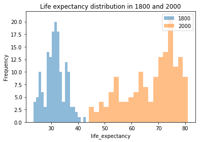


```python
histogram_draw('income_per_person', 'Income per person distribution in 1800 and 2000')
```


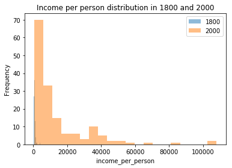


```python
histogram_draw('population', 'Population distribution in 1800 and 2000')
```


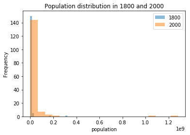


```python
histogram_draw('children_per_woman', 'Children per woman distribution in 1800 and 2000')
```


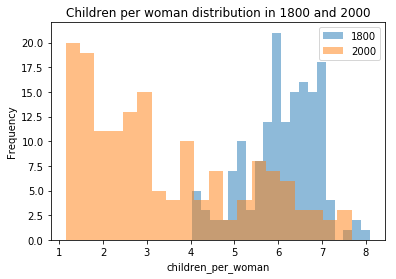


```python
histogram_draw('child_mortality', 'Children 0-5 years old die per 1000 born in 1800 and 2000')
```


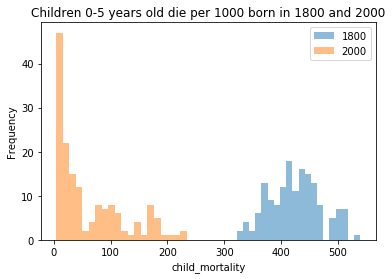


Now let's explore more profoundly using box plots to see changes in each region


```python
# Write a function to draw a box plot for each feature
def box_draw(feature_name, plot_title_1, plot_title_2, log_scale=False):
    gapminder_1800.boxplot(feature_name, by='region', rot=90)
    plt.title(plot_title_1)
    plt.suptitle("")
    plt.xlabel('Region')
    plt.ylabel(feature_name)
    if log_scale: plt.yscale('log')
    
    gapminder_2000.boxplot(feature_name, by='region', rot=90)
    plt.title(plot_title_2)
    plt.suptitle("")
    plt.xlabel('Region')
    plt.ylabel(feature_name)
    if log_scale: plt.yscale('log')
```


```python
box_draw('life_expectancy', 'Life expectancy in 1800', 'Life expectancy in 2000')
```


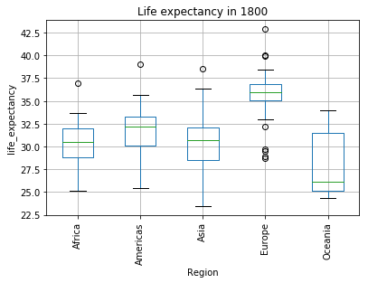


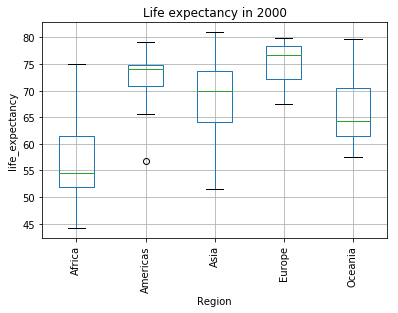


```python
box_draw('income_per_person', 'Income per person in 1800', 'Income per person in 2000', True)
```


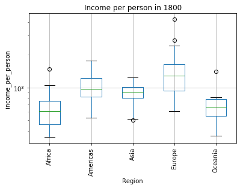


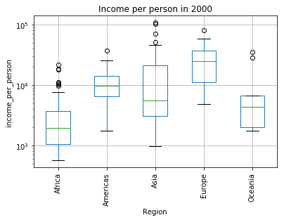


```python
box_draw('population', 'Population in 1800', 'Population in 2000', True)
```


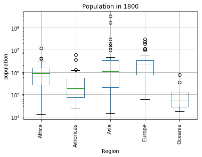


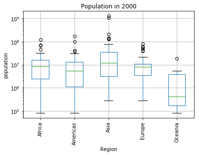


```python
box_draw('children_per_woman', 'Children per woman in 1800', 'Children per woman in 2000')
```


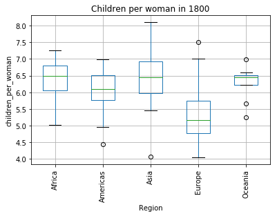


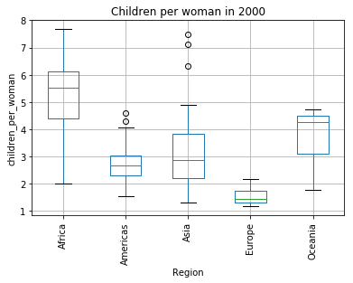


```python
box_draw('child_mortality', 'Child mortality in 1800', 'Child mortality in 2000')
```


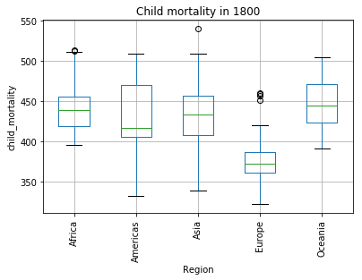


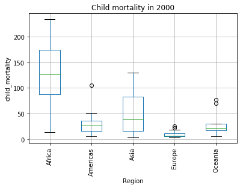


###  Question 1:

_**Which region of the world has been changing relatively quick compare to others in terms of GDP, life expectancy, and other indices?**_

#### Life expectancy
**Definition:** The average number of years a newborn child would live if current mortality patterns were to stay the same.

As we can observe firstly in the histogram, life expectancy was improved significantly between the year 1800 and 2000 as there is no overlapping in the plot. Move on to the box plot, it seems that Asian, European, and American countries have remarkably augmented their life expectancy. Now let's see which continent improve it most.


```python
life_region_1800 = gapminder_1800.groupby('region')['life_expectancy'].mean()
life_region_1800
```


    region
    Africa      30.304167
    Americas    31.782143
    Asia        30.197436
    Europe      35.615152
    Oceania     28.166667
    Name: life_expectancy, dtype: float64


```python
life_region_2000 = gapminder_2000.groupby('region')['life_expectancy'].mean()
life_region_2000
```


    region
    Africa      56.806250
    Americas    72.689286
    Asia        69.171795
    Europe      75.554545
    Oceania     66.977778
    Name: life_expectancy, dtype: float64


```python
life_change = life_region_2000 - life_region_1800
print "The contient which has changed most in life expectancy is: %s" % (life_change.idxmax())
```

    The contient which has changed most in life expectancy is: Americas
    

#### Income
**Definition:** Gross domestic product per person adjusted for differences in purchasing power (in international dollars, fixed 2011 prices, PPP based on 2011 ICP)

In the distribution plot, the difference between income per person of 1800 and 2000 was huge that we can merely see the one of 1800. This difference can be observed again in the box plot among regions where Asia seems to have the biggest change. Let's verify that


```python
income_region_1800 = gapminder_1800.groupby('region')['income_per_person'].mean()
income_region_1800
```


    region
    Africa       633.166667
    Americas    1028.535714
    Asia         881.846154
    Europe      1421.454545
    Oceania      707.222222
    Name: income_per_person, dtype: float64


```python
income_region_2000 = gapminder_2000.groupby('region')['income_per_person'].mean()
income_region_2000
```


    region
    Africa       4022.604167
    Americas    11118.928571
    Asia        18172.615385
    Europe      26736.666667
    Oceania      9727.777778
    Name: income_per_person, dtype: float64


```python
income_change = income_region_2000 - income_region_1800
print "The continent which has changed most in income per person is: %s" % income_change.idxmax()
```

    The continent which has changed most in income per person is: Europe
    

#### Population
**Definition:** Total population

The same as income, there is a huge difference between population of 1800 and 2000. While in 1800, most of countries share the same population, in 2000, there are two or three countries who have more people than the rest of the world. In the box plots, we have these countries as outliers.


```python
population_region_1800 = gapminder_1800.groupby('region')['population'].mean()
population_region_1800
```


    region
    Africa      1.323533e+06
    Americas    6.513393e+05
    Asia        1.578419e+07
    Europe      4.509467e+06
    Oceania     1.673000e+05
    Name: population, dtype: float64


```python
population_region_2000 = gapminder_2000.groupby('region')['population'].mean()
population_region_2000
```


    region
    Africa      1.486134e+07
    Americas    1.850591e+07
    Asia        8.846679e+07
    Europe      1.513445e+07
    Oceania     3.366278e+06
    Name: population, dtype: float64


```python
population_change = population_region_1800 - population_region_2000
print "The contient which has changed most in population is: %s" % population_change.idxmax()
```

    The contient which has changed most in population is: Oceania
    

#### Children per woman
**Definition:** Total fertility rate. The number of children that would be born to each woman with prevailing age-specific fertility rates.

There is a decrese in the number of children between 1800 and 2000. However, there is still an overlappping in the middle of the plot. While America, Europe, and Asia have dropped their fertility notably, the number of children per woman in Africa still remains high.


```python
fertility_region_1800 = gapminder_1800.groupby('region')['children_per_woman'].mean()
fertility_region_1800
```


    region
    Africa      6.399167
    Americas    6.022500
    Asia        6.428205
    Europe      5.233939
    Oceania     6.290000
    Name: children_per_woman, dtype: float64


```python
fertility_region_2000 = gapminder_2000.groupby('region')['children_per_woman'].mean()
fertility_region_2000
```


    region
    Africa      5.217708
    Americas    2.733929
    Asia        3.143333
    Europe      1.520303
    Oceania     3.695556
    Name: children_per_woman, dtype: float64


```python
fertility_change = fertility_region_1800 - fertility_region_2000
print "The contient which has changed most in fertility is: %s" % fertility_change.idxmax()
```

    The contient which has changed most in fertility is: Europe
    

#### Child mortality
**Definition:** Death of children under five years of age per 1000 live births

Thanks to the development of health care system all over the world, we can see a clear gap between two distribution of 1800 and 2000. Let's see how this difference varies among regions


```python
mortality_region_1800 = gapminder_1800.groupby('region')['child_mortality'].mean()
mortality_region_1800
```


    region
    Africa      442.229167
    Americas    431.285714
    Asia        434.358974
    Europe      379.666667
    Oceania     445.000000
    Name: child_mortality, dtype: float64


```python
mortality_region_2000 = gapminder_2000.groupby('region')['child_mortality'].mean()
mortality_region_2000
```


    region
    Africa      128.043750
    Americas     29.214286
    Asia         49.512821
    Europe        9.193939
    Oceania      31.300000
    Name: child_mortality, dtype: float64


```python
mortality_change = mortality_region_1800 - mortality_region_2000
print "The continent which has changed most in child mortality is: %s" % mortality_change.idxmax()
```

    The continent which has changed most in child mortality is: Oceania
    

### Question 2:

_**How income, population, child mortality and children born per woman decide the life expectancy of a certain country?**_

To answer this question, we will investigate the dataset on only a small set of countries. First, we need to create for each country their corresponding data from 1800 to 2000.


```python
# Create a list of 5 different countries
five_countries = ['Colombia', 'Nigeria', 'Germany', 'China', 'Australia']
```


```python
# Write a function to return a dataframe for a country
def make_dataframe_for_country(country_name):
    df = pd.DataFrame()
    df['life_expectancy'] = life_exp.query('geo == @country_name').loc[:, '1800':'2000'].transpose().iloc[:,0] # get the Series instead of DataFrame
    df['income_per_person'] = income.query('geo == @country_name').loc[:, '1800':'2000'].transpose().iloc[:,0]
    df['population'] = population.query('geo == @country_name').loc[:, '1800':'2000'].transpose().iloc[:,0]
    df['child_mortality'] = child_mortality.query('geo == @country_name').loc[:, '1800':'2000'].transpose().iloc[:,0]
    df['children_per_woman'] = children_per_woman.query('geo == @country_name').loc[:, '1800':'2000'].transpose().iloc[:,0]
    df.index = pd.to_datetime(df.index) # convert index to datetime
    return df
```


```python
five_countries_df = list(map(make_dataframe_for_country, five_countries))
```


```python
five_countries_df[-1].head()
```


<div>
<table border="1" class="dataframe">
  <thead>
    <tr style="text-align: right;">
      <th></th>
      <th>life_expectancy</th>
      <th>income_per_person</th>
      <th>population</th>
      <th>child_mortality</th>
      <th>children_per_woman</th>
    </tr>
  </thead>
  <tbody>
    <tr>
      <th>1800-01-01 00:00:00</th>
      <td>34.0</td>
      <td>814</td>
      <td>351000</td>
      <td>391.0</td>
      <td>6.50</td>
    </tr>
    <tr>
      <th>1801-01-01 00:00:00</th>
      <td>34.0</td>
      <td>816</td>
      <td>350000</td>
      <td>391.0</td>
      <td>6.48</td>
    </tr>
    <tr>
      <th>1802-01-01 00:00:00</th>
      <td>34.0</td>
      <td>818</td>
      <td>349000</td>
      <td>391.0</td>
      <td>6.46</td>
    </tr>
    <tr>
      <th>1803-01-01 00:00:00</th>
      <td>34.0</td>
      <td>820</td>
      <td>348000</td>
      <td>391.0</td>
      <td>6.44</td>
    </tr>
    <tr>
      <th>1804-01-01 00:00:00</th>
      <td>34.0</td>
      <td>822</td>
      <td>348000</td>
      <td>391.0</td>
      <td>6.42</td>
    </tr>
  </tbody>
</table>
</div>


There is still the problem with this dataframe nevertheless as we can see some values don't change much throughout the year, so we might need to resample our dataset


```python
five_countries_df = [df.resample('10Y').mean() for df in five_countries_df]
five_countries_df[-1].head()
```


<div>
<table border="1" class="dataframe">
  <thead>
    <tr style="text-align: right;">
      <th></th>
      <th>life_expectancy</th>
      <th>income_per_person</th>
      <th>population</th>
      <th>child_mortality</th>
      <th>children_per_woman</th>
    </tr>
  </thead>
  <tbody>
    <tr>
      <th>1800-12-31 00:00:00</th>
      <td>34.0</td>
      <td>814.0</td>
      <td>351000.0</td>
      <td>391.0</td>
      <td>6.500</td>
    </tr>
    <tr>
      <th>1810-12-31 00:00:00</th>
      <td>34.0</td>
      <td>824.5</td>
      <td>346200.0</td>
      <td>391.0</td>
      <td>6.390</td>
    </tr>
    <tr>
      <th>1820-12-31 00:00:00</th>
      <td>34.0</td>
      <td>844.0</td>
      <td>337500.0</td>
      <td>391.0</td>
      <td>6.190</td>
    </tr>
    <tr>
      <th>1830-12-31 00:00:00</th>
      <td>34.0</td>
      <td>1037.9</td>
      <td>337800.0</td>
      <td>391.0</td>
      <td>5.957</td>
    </tr>
    <tr>
      <th>1840-12-31 00:00:00</th>
      <td>34.0</td>
      <td>1765.0</td>
      <td>389000.0</td>
      <td>391.0</td>
      <td>5.557</td>
    </tr>
  </tbody>
</table>
</div>


```python
# Write a function to draw a plot for a feature
def draw_one_feature(feature_name, country_df, country_name):
    plt.plot(country_df[feature_name], label=country_name)
    plt.title(feature_name + ' from 1800 to 2000 for all countries')
    plt.legend(loc='upper left')
```


```python
feature_list = five_countries_df[-1].columns
for i in range(len(feature_list)):
    plt.figure(i, figsize=(6,4))
    map(draw_one_feature, [feature_list[i]]*len(five_countries_df), five_countries_df, five_countries)
plt.show()
```


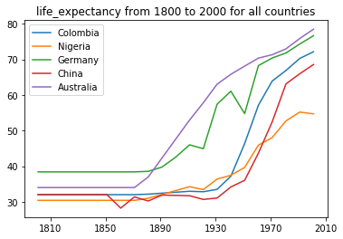


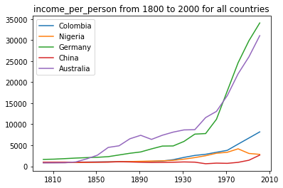


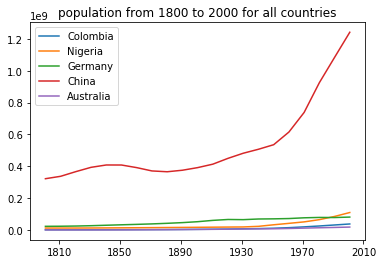


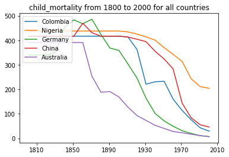


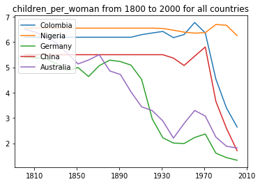


Let's stop here a little and try to refind what we concluded in our first question by revising the plot of each feature:

- **Life expectancy:** no surprising that countries in Europe and Americas have the biggest improvement in terms of average age limit. 
- **Income per person:** another winning for Europe and Americas. Despite being a fast developing country, China has its income per person quite modest.
- **Population:** while other countries don't have any significant change in the number of inhabitants, China has shown a remarkable increase.
- **Children per woman and child mortality:** African countries still do not have any big change in these two indices whereas countries in Europe, Asia, and Americas decreased their number notably. 


```python
# Write a function to draw scatter plot
def draw_one_feature_scatter(feature_name, country_df, country_name):
    plt.scatter(country_df[feature_name], country_df.life_expectancy, label=country_name, alpha=0.5)
    plt.title(feature_name + ' vs life expectancy in all countries from 1800 to 2000')
    plt.legend(loc='lower right')
```


```python
# Now let's try with some correlation plot
feature_list_to_compare = ['income_per_person', 'population', 'children_per_woman', 'child_mortality']
for i in range(len(feature_list_to_compare)):
    plt.figure(i, figsize=(6,4))
    map(draw_one_feature_scatter, [feature_list_to_compare[i]]*len(five_countries_df), five_countries_df, five_countries)
plt.show()
```


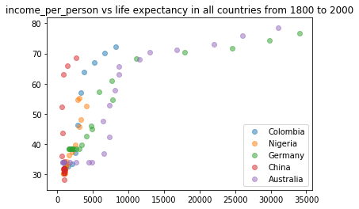


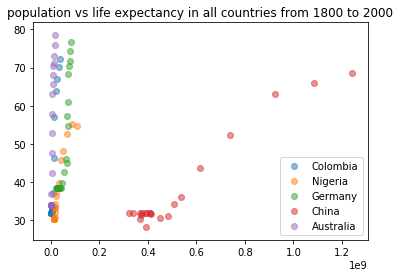


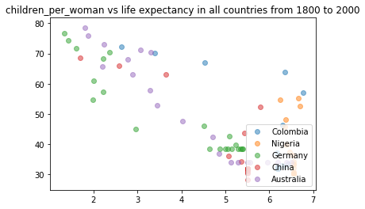


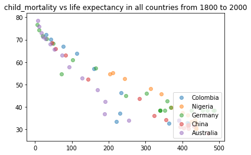


As from the correlation plots, the answer to our quetion seems to be that while income per person has the positive correlation to the average life expectancy, number of children per woman and child mortality have the negative correlation. Concerning population, apart from China, this indice doesn't have significant effect on life expectancy.

### Limitation
This section aims to address the challenges that I personally faced while implementing this project. 

- The first challenge that I had is to pick the data. The whole dataset combined of many indicies (income, life expectancy, education, etc.) so I had to decide which one to take in order to carry out this project.

- Next, I had some difficulties trying to put all the dataset into a right place. At first I was doing this manually, but then I took advantages of Pandas and Numpy operation to make this lot quicker.

- The data does not contain information about the region for each country, therefore I have to look somewhere else this information to answer my questions.

<a id='conclusions'></a>
## Conclusions

The goal of this project is to investigate a real dataset using analysis technique. The two questions posed at the beginning of the project have been answered through statistics and visualizations. With this dataset from Gapminder, we could have another view of the world based merely on data and appropriate communication. The future work for this project might be to explore more foundly the data by pointing out certain trends or several big events which effect the world's data such as world war or natural disater.
